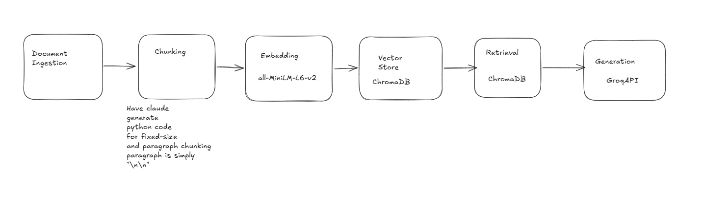

# Project 1 Planning: The Unofficial Guide

> Write this document before you write any pipeline code.
> Your spec and architecture diagram are what you'll use to direct AI tools (Claude, Copilot, etc.) to generate your implementation — the more specific they are, the more useful the generated code will be.
> Update the Retrieval Approach and Chunking Strategy sections if you change your approach during implementation.
> Update this file before starting any stretch features.

---

## Domain

<!-- What domain did you choose? Why is this knowledge valuable and hard to find through official channels? -->
I'm choosing a CS Course selection and survival guide for Haverford College. I want to span the 
CS course lottery, difficulty of courses, professor course structure and grading policies. This sort of 
knowledge is mostly informal. You find out which courses are tough by word of mouth and you only get 
grading info and course insights if you enroll and get a syllabus. I don't think I was aware of the 
CS course lottery until I got to campus; even though it is on the registrar's website.

---

## Documents

<!-- List your specific sources: URLs, subreddit names, forum threads, or file descriptions.
     Aim for at least 10 sources that together cover different subtopics or perspectives within your domain. -->

| # | Source | Description | URL or location |
|---|--------|-------------|-----------------|
| 1 | Haverford College Website | Information about course lotteries | https://www.haverford.edu/registrar/lotteries | 
| 2 | College Confidential | Information about CS course difficulty and 4+1 | https://talk.collegeconfidential.com/t/math-computer-science-4-1-w-upenn/1869266 |
| 3 | Rate My Professor | Prof Wonacott's RMP | https://www.ratemyprofessors.com/professor/752469 |
| 4 | RMP | Steven Lindell RMP | https://www.ratemyprofessors.com/professor/2238783 |
| 5 | Reddit | Is Haverford good for CS? | https://www.reddit.com/r/Pennsylvania/comments/10630z4/is_haverford_college_decent_for_comp_sci_looking/ |
| 6 | Student-run Campus Publication | Letter about Shortage | https://haverfordclerk.com/open-letter-on-the-shortage-of-computer-science-faculty/ |
| 7 | RMP | RMP Prof. Dung Nguyen | https://www.ratemyprofessors.com/professor/3122048 |
| 8 | RMP | RMP John Dougherty | https://www.ratemyprofessors.com/professor/2349369 |
| 9 | RMP | Sorelle Friedler RMP | https://www.ratemyprofessors.com/professor/2041582 |
| 10 | Reddit | How are CS/math depts? | https://www.reddit.com/r/Haverford/comments/1kkygm5/how_is_the_computer_science_and_math_departments/ |
| 11 | Haverford website | Requirements | https://www.haverford.edu/academics/computer-science-major-minor-and-concentration | 
| 12 | Haverford Course Catalog | Course Catalog | https://www.haverford.edu/computer-science/courses/course-catalog |

---

## Chunking Strategy

<!-- How will you split documents into chunks?
     State your chunk size (in tokens or characters), overlap size, and explain why those
     numbers fit the structure of your documents.
     A review-heavy corpus warrants different chunking than a long FAQ. -->

     chunking reddit, college confidential, and professor reviews may be similar. I think that chunking the requirements page, an article, and the course lottery page might be different. 

     Paragraph splitting seems good for college confidential, professor reviews, requirements, the article and lottery page. I think most of the meaning bites will be in a pragraph. I think for reddit I would use fixed chunking because people can write in weird formats at times. 

     Prompted Claude some: big chunks hurt opinion reviews because a large chunk size will swallow several reviews (loss of meaning). So, it is 
     good that I had decided to use paragraph splitting. Chunk size for reddit
     could hurt us potentially, but I feel like the overlap gives some safety.
     I'm expecting some repercussions though.

**Chunk size:**
     400-600. (Reddit, will use paragraph splitting otherwise)

**Overlap:**

     100 chars

**Reasoning:**
     400-600 chars looks like a reasonable size chunk for reddit; I looked at visuals of char counts online. 100 chars overlap seems like it would capture meaningful idea boundaries.

---

## Retrieval Approach
<!-- Which embedding model are you using (e.g., all-MiniLM-L6-v2 via sentence-transformers)?
     How many chunks will you retrieve per query (top-k)?
     If you were deploying this for real users and cost wasn't a constraint, what tradeoffs
     would you weigh in choosing a different embedding model — context length, multilingual
     support, accuracy on domain-specific text, latency? -->

**Embedding model:**
all-MiniLM-L6-v2 from sentence-transformers should be fine

**Top-k:**
I am going to try 5 chunks at first and maybe add some more if answers are poor. Too many adds irrelavent info.

**Production tradeoff reflection:**
(Had claude help) There are better models for student informal language and slang like text-embedding-3-large or Voyage/Cohere. Another embedding model could be useful for the long requirements and course lottery pages. 

---

## Evaluation Plan

<!-- List your 5 test questions with their expected correct answers.
     Questions should be specific enough that you can judge whether the system's response
     is right or wrong. "What are good dining halls?" is too vague.
     "What do students say about wait times at [dining hall name] during lunch?" is testable. -->

| # | Question | Expected answer |
|---|----------|-----------------|
| 1 | What is CS240 about? | Principles of Computer Organization...etc. |
| 2 | What is Professor Wonacott like? | Student reviews are mixed. He is noted as being friendly, not the best at teaching, and long-winded.  |
| 3 | What is the course lottery like at Haverford? | The lottery can be stressful because you are not guaranteed a course, but if you stick through it usually it's ok. |
| 4 | What is the CS department like? | Generally nice. Pretty theoretical over applied. |
| 5 | What courses should a first-year student take to start CS, and are they difficult? | Start with CS105/106 depending on background. CS105 is introductory and approachable; CS106 requires more background. Both are foundational before jumping into theory-heavy courses like CS245. Workload is moderate but consistent. |

---

## Anticipated Challenges

<!-- What could go wrong? Name at least two specific risks with reasoning.
     Consider: noisy or inconsistent documents, missing source attribution, off-topic
     retrieval, chunks that split key information across boundaries. -->

1. I am worried that I may not have enough information to answer everything I wanted in scope. I think some of the limitation is that there are actually not many online sources since Haverford is a smaller institution.

2. Chunk size for reddit may be too big or too small for some comments.

---

## Architecture

<!-- Draw a diagram of your pipeline showing the five stages:
     Document Ingestion → Chunking → Embedding + Vector Store → Retrieval → Generation
     Label each stage with the tool or library you're using.
     You can use ASCII art, a Mermaid diagram, or embed a sketch as an image.
     You'll use this diagram as context when prompting AI tools to implement each stage. -->

---

## AI Tool Plan

<!-- For each part of the pipeline below, describe:
     - Which AI tool you plan to use (Claude, Copilot, ChatGPT, etc.)
     - What you'll give it as input (which sections of this planning.md, which requirements)
     - What you expect it to produce
     - How you'll verify the output matches your spec

     "I'll use AI to help me code" is not a plan.
     "I'll give Claude my Chunking Strategy section and ask it to implement chunk_text()
     with my specified chunk size and overlap" is a plan. -->

     

     

**Milestone 3 — Ingestion and chunking:**

     Going to use AI to write the chunking code based on my chunk size and overlap. Will need a paragraph breaking chunker + fixed size chunker.

**Milestone 4 — Embedding and retrieval:**

     Use AI to help ChromaDB setup if necessary (may not be). Use it to help with embedding chunks if need be and debugging as needed; I can probably not use it for this part.

     Retrieve from ChromaDB (don't think AI needs to be heavily used here). Could have it generate it.

     Probably have AI load up the test cases.

**Milestone 5 — Generation and interface:**

     AI doesn't seem particularly necessary here.
     Maybe adjust UI with it if needed

AI Transparency:

Used AI to learn more about embedding tradeoffs and to understand further what the project is asking of me since I'm new to the content. 
